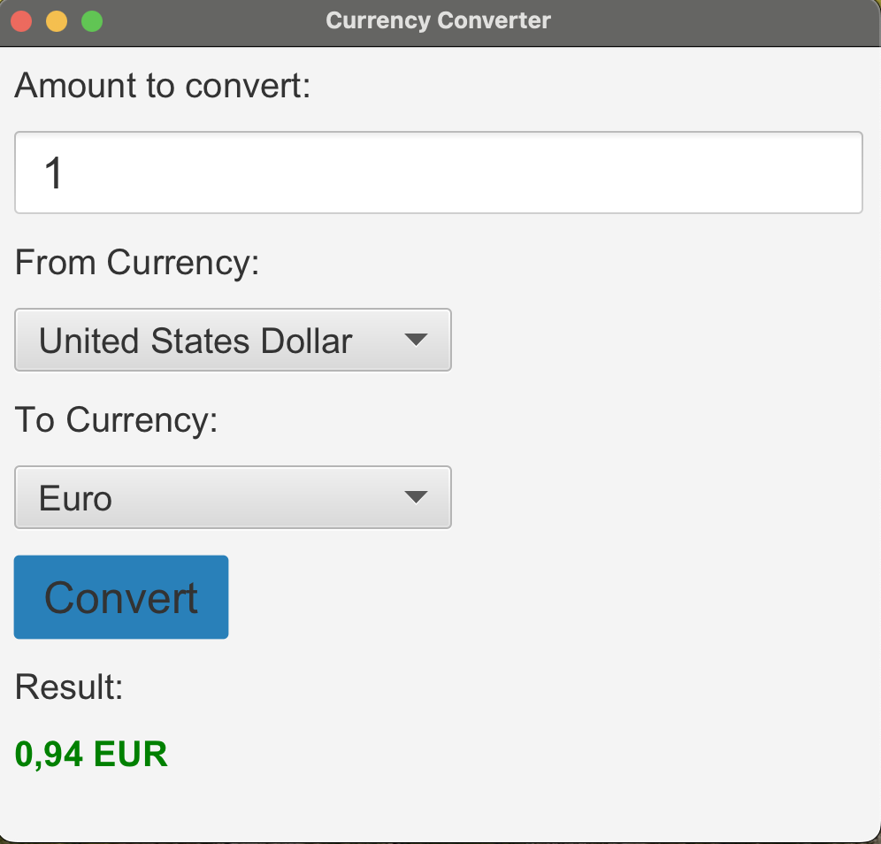

# JavaFX Currency Converter

## Overview

The JavaFX Currency Converter is an application that allows users to convert an amount of money from one currency to another. It is built using the Model-View-Controller (MVC) design pattern and features a graphical user interface implemented with JavaFX. This application is an excellent demonstration of JavaFX layouts, CSS styling, and proper separation of concerns using MVC.



## Features

- **User-Friendly Interface**: A simple and intuitive interface with clear labels and instructions.
- **Currency Selection**: Users can select the source and target currencies from a list.
- **Error Handling**: Provides feedback for invalid inputs and ensures smooth user experience.

## Components

### Model

- **Currency**: Represents a currency with an abbreviation, name, and conversion rate.
- **CurrencyModel**: Manages a list of `Currency` objects.

### View

- **CurrencyConverterView**: The main JavaFX application class that sets up the user interface components and handles user interactions.

### Controller

- **CurrencyConverterController**: Manages the logic for currency conversion and interacts with the model to fetch data.

## Setup and Usage

### Prerequisites

- Java 17 or higher
- JavaFX SDK
- Maven (for dependency management)

### Usage Instructions
1. Enter the amount: Type the amount you wish to convert in the input field.
2. Select currencies: Choose the source and target currencies from the dropdown lists.
3. Convert: Click the "Convert" button to see the converted amount.
4. Error Handling: If you enter invalid data or leave required fields empty, the application will display an appropriate error message.


### Running the Application

1. **Clone the repository**:

   ```sh
   git clone <repository-url>
   cd <repository-directory>
    ```

## Contributing
Pull requests are welcome. For major changes, please open an issue first to discuss what you would like to change.

